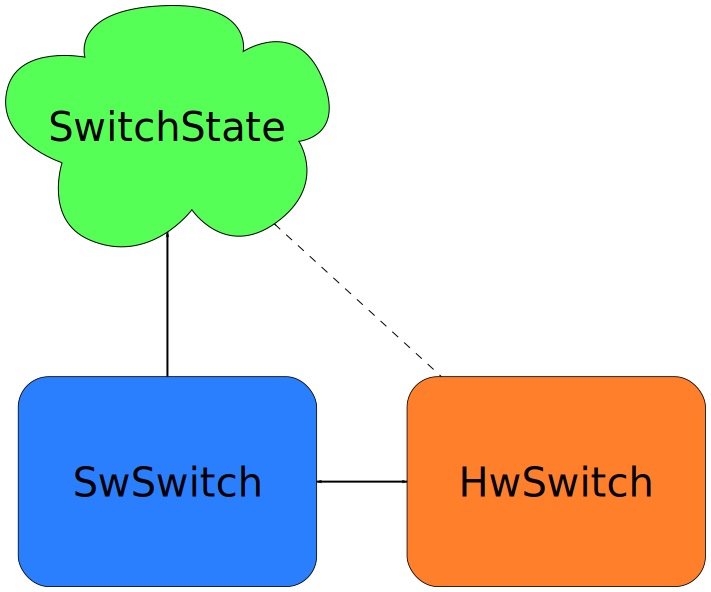

FBOSS Controller Design
=======================

The FBOSS controller consists of three main components: the SwitchState,
SwSwitch, and HwSwitch.

The SwitchState is an in-memory representation of the state of the switch.  At
any point in time, it describes the current configuration of the switch, and
contains all information needed to figure out how any packet should be handled
by the switch.

The SwSwitch class represents all of the hardware-independent logic for the
switch.  Think of this class as a software-only switch implementation.  It
contains a pointer to the current SwitchState, and can then use that to process
received packets.

HwSwitch is an abstraction around all of the hardware-dependent logic.  There
may be many different hardware implementations, but they each provide the API
described by the HwSwitch class.

Software/Hardware Interface
===========================

The HwSwitch class defines the interface between software and hardware.  It
abstracts away all hardware-specific details, and provides the hardware
abstraction layer (HAL) for FBOSS.

Communication can flow in both directions between the SwSwitch and HwSwitch.
The SwSwitch will inform the HwSwitch whenever the SwitchState changes.  In the
reverse direction, the HwSwitch notifies the SwSwitch about a variety of
events, such as receipt of a trapped packet, link state changes, etc.

We have tried to keep this interface very simple and generic, so it can
accommodate a wide variety of hardware platforms.  In particular, HwSwitch only
has a single function for updating its state.  HwSwitch::stateChanged() is
called whenever the SwitchState changes.  This method takes a StateDelta
argument which lists both the old and new SwitchState objects.  It is up to the
HwSwitch class to figure out how this change should be applied to it's
particular hardware configuration.

The SwSwitch code also has relatively low expectations of the HwSwitch.
HwSwitch should try to accelerate packet forwarding in hardware.  However, if
the HwSwitch does not support some part of the configuration, it is free to
trap packets up to software and let the SwSwitch deal with forwarding them in
software.  The SwSwitch code should work correctly (albeit more slowly) even
for a HwSwitch implementation that has no hardware forwarding support, and
traps all packets to the SwSwitch.

Because the HwSwitch API is very simple, and places very little expectations or
requirements on the HwSwitch implementation, we should be able to build
HwSwitch implementations for a wide variety of hardware.

However, one downside of this API is that it may be complicated for the
HwSwitch code to take a state change and determine how to apply it.  To help
simplify this, there is some common helper code for taking a StateDelta and
breaking it down into simpler operations that should be performed.  HwSwitch
implementations are encouraged to use this helper code, but are not required
to.

Multi-Chip Platforms
--------------------

Only a one SwSwitch and one HwSwitch object exist within the controller.  These
objects are effectively singletons.  The SwSwitch and HwSwitch together
represent the entire switch.  Even on platforms which contain multiple distinct
switching ASICs, there is only a single HwSwitch object.  The HwSwitch must
abstract away any hardware specific details, including how many switching ASICs
exist in the platform.  HwSwitch simply exposes a set of ports to the software,
nothing more.
